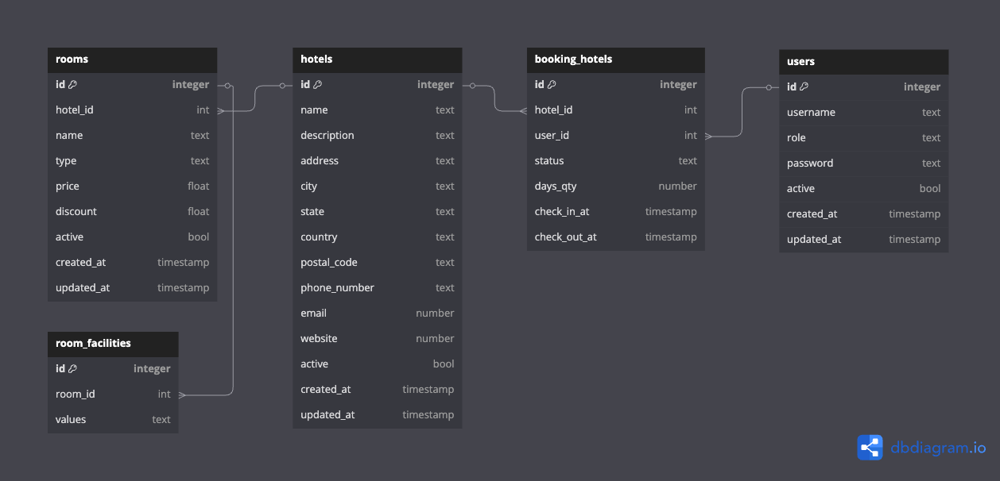

# Booking API

## Description

A simple RESTful Booking hotel web service written in Go programming language. This project is a part of my learning process in understanding [Hexagonal Architecture](https://alistair.cockburn.us/hexagonal-architecture/) in Go.

It uses [Fiber](https://gofiber.io) as the HTTP framework and [PostgreSQL](https://www.postgresql.org/) as the database with [GORM](https://pkg.go.dev/gorm.io/gorm) as the ORM lib.

<!-- ## Getting Started

1. If you do not use devcontainer, ensure you have [Go](https://go.dev/dl/) 1.23 or higher and [Task](https://taskfile.dev/installation/) installed on your machine:

    ```bash
    go version && task --version
    ```

2. Create a copy of the `.env.example` file and rename it to `.env`:

    ```bash
    cp .env.example .env
    ```

    Update configuration values as needed.

3. Install all dependencies, run docker compose, create database schema, and run database migrations:

    ```bash
    task
    ```

4. Run the project in development mode:

    ```bash
    task dev
    ``` -->

## Schema

Can you copy schema defind from "schema.dbml" and parse to [dbdiagram](https://dbdiagram.io)


<!-- ## Documentation

For database schema documentation, see [here](https://dbdocs.io/bagashiz/Go-POS/), powered by [dbdocs.io](https://dbdocs.io/).

API documentation can be found in `docs/` directory. To view the documentation, open the browser and go to `http://localhost:8080/docs/index.html`. The documentation is generated using [swaggo](https://github.com/swaggo/swag/) with [gin-swagger](https://github.com/swaggo/gin-swagger/) middleware.

## Contributing

Developers interested in contributing to Go POS project can refer to the [CONTRIBUTING](CONTRIBUTING.md) file for detailed guidelines and instructions on how to contribute. -->
